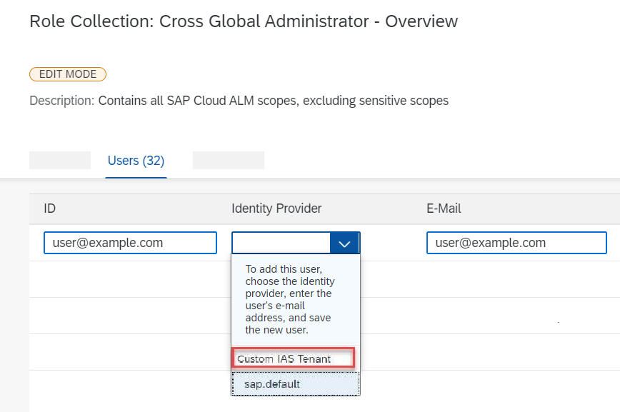

<!-- loio7304b17f3aac4ebaa24c5c6a3a8e236e -->

<link rel="stylesheet" type="text/css" href="../css/sap-icons.css"/>

# Step 2: Assign Roles to Users in SAP Cloud ALM

After onboarding your users to the Identity Authentication tenant, you need to add them to SAP Cloud ALM and assign roles to them.

You can assign roles to users directly in the SAP Cloud ALM *User Management* app \(recommended\) or in the SAP BTP cockpit.

> ### Note:  
> If you're working with role mapping to user groups in your identity provider, you must assign role collections in the SAP BTP cockpit. In this case, you can't view or change roles in the *User Management* app. You also can't use the role request and assignment features in SAP Cloud ALM, so we don't recommend this method.

<a name="loio7304b17f3aac4ebaa24c5c6a3a8e236e__section_g43_crh_jmb"/>

## SAP Cloud ALM User Management \(Recommended\)

### Prerequisites

-   Your user has the role *Global Administrator* or *User Administrator*.

    If you've requested SAP Cloud ALM, you've automatically received the role *Global Administrator*. If someone else has requested SAP Cloud ALM, they can assign one of the required roles to you by following the process below.

-   The identities of the users to whom you want to assign roles already exist in the identity provider, as described in [Step 1: Onboard Users in Your Identity Authentication Service](step-1-onboard-users-in-your-identity-authentication-service-f2a8a8c.md).

### Procedure

1.  Access SAP Cloud ALM. A link is included in the email *Welcome to SAP Cloud ALM*.

    Sign in with the email address and password you've defined when activating your account in the Identity Authentication service. Do not sign in with your S-user.

2.  Open the *User Management* app, which is located in the *Administration* section.

3.  To go to the user list, choose  \(Users\).

4.  Choose *Add User*.

5.  Enter the user ID and/or email address as you've defined them in the settings of your identity provider. If, as per our recommendations, you've selected your email address as your user ID in your identity provider, you only need to enter the email address.

6.  Select a type for your user. Possible types are:

    <table>
    <tr>
    <th valign="top">

    Type

    
    </th>
    <th valign="top">

    Description

    
    </th>
    </tr>
    <tr>
    <td valign="top">

     *Not Assigned* 

    
    </td>
    <td valign="top">

    No user type \(default value\)

    
    </td>
    </tr>
    <tr>
    <td valign="top">

     *Employee* 

    
    </td>
    <td valign="top">

    Employee of your company

    
    </td>
    </tr>
    <tr>
    <td valign="top">

     *SAP* 

    
    </td>
    <td valign="top">

    Consultant from SAP

    
    </td>
    </tr>
    <tr>
    <td valign="top">

     *Partner* 

    
    </td>
    <td valign="top">

    Consultant from official SAP partner

    
    </td>
    </tr>
    <tr>
    <td valign="top">

     *Other* 

    
    </td>
    <td valign="top">

    Person from a company other than SAP or official SAP partner

    
    </td>
    </tr>
    </table>
    
7.  Assign one or multiple roles to the user.

    For an overview of all predefined role collections that are available in SAP Cloud ALM, refer to [Role Collections](role-collections-e1915af.md).

8.  Save your settings.

The user will now also receive a welcome email from SAP Cloud ALM.

For more information on how to use the *User Management* app to view, add, and change roles, refer to the in-app help.

<a name="loio7304b17f3aac4ebaa24c5c6a3a8e236e__section_amj_f5z_tqb"/>

## SAP BTP Cockpit

### Prerequisites

-   Your user has the role *Subaccount Administrator* in the subaccount that contains your SAP Cloud ALM subscription.

    If you have requested SAP Cloud ALM, your user has automatically received this authorization during the creation of the subaccount. If you don't have this authorization, the subaccount administrator can assign the role to you by following the steps described in [Add Members to Your Subaccount](https://help.sap.com/viewer/65de2977205c403bbc107264b8eccf4b/LATEST/en-US/1e1b7b60bb1b4764a2d4bb96bd73182d.html).

-   The identities of the users to whom you want to assign roles already exist in the identity provider, as described in [Step 1: Onboard Users in Your Identity Authentication Service](step-1-onboard-users-in-your-identity-authentication-service-f2a8a8c.md).

### Procedure

1.  Open the [SAP BTP cockpit](https://cockpit.eu10.hana.ondemand.com/cockpit).

2.  Select the global account that contains your SAP Cloud ALM entitlement, which was created when you requested SAP Cloud ALM.

3.  Under *Subaccounts*, select the subaccount that contains your SAP Cloud ALM subscription.

4.  Navigate to *Security* \> *Role Collections*.

5.  Select the role collection to which you want to add users.

6.  Choose *Edit*.

7.  Add users to this role collection as follows:

    -   If you’re using the standard configuration in trust settings and identity provider that were set when you requested SAP Cloud ALM, enter the email address of the user into the fields *ID* **and** *E-Mail*. Select *Custom IAS Tenant* as identity provider.

          

    -   If you've manually connected the identity provider or selected a different identification attribute \(such as user ID\) in your identity provider, enter the identification attribute that you maintained there into the field *ID* and make sure to select the correct identity provider.

        Don't use the identity provider that's named *SAP ID Service* or *sap.default*.

-   **[Role Collections](role-collections-e1915af.md "Roles in SAP Cloud ALM are delivered as predefined collections. You don't have to configure any role collections yourself. Instead, you
		can simply assign the relevant role collections to the users based on their tasks and requirements.")**  
Roles in SAP Cloud ALM are delivered as predefined collections. You don't have to configure any role collections yourself. Instead, you can simply assign the relevant role collections to the users based on their tasks and requirements.

