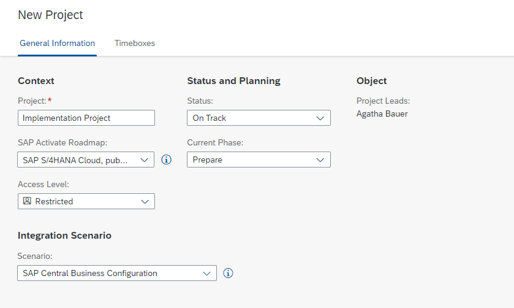

<!-- loioe21f91558ab145378c0c6de77516cec6 -->

# Integrating SAP Central Business Configuration

By integrating SAP Central Business Configuration with SAP Cloud ALM, you can import roadmap content into the *Tasks* app. This helps you understand the order in which the tasks need to be executed, and allows you to navigate directly to SAP Central Business Configuration as needed.

SAP Central Business Configuration is a solution that allows you to configure business processes that span across various SAP products from one central place.

While an SAP Cloud ALM project applies the SAP Activate methodology to provide end-to-end procedural guidance on how to start and execute an implementation project, an SAP Central Business Configuration project shows the project and configuration activities focused on your specific business configuration.

To use SAP Central Business Configuration in SAP Cloud ALM, you first need to perform the following setup procedure.

<a name="loioe21f91558ab145378c0c6de77516cec6__section_qyd_jx4_nnb"/>

## Procedure

### Technical Setup

Create a cloud service and an endpoint for SAP Central Business Configuration by carrying out the following steps:

1.  In the SAP Cloud ALM launchpad, open the *Landscape Management* app.

2.  On the *Cloud Services* page, check whether the SAP Central Business Configuration cloud service has already been imported. If so, proceed directly to step 5.

3.  If the SAP Central Business Configuration cloud service hasn't been imported yet, choose *Add* and enter the following parameters:

    -   *Name*: Enter a name that is unique to your customer account, such as ***Central Business Configuration Tenant***.

    -   *Description*: Enter a short description, such as ***Used for SAP Cloud ALM project integration***.

    -   *Tenant ID*: Enter your SAP Central Business Configuration tenant ID.

    -   *Cloud Service Type*: Select ***SAP Central Business Configuration***.

    -   *Tenant Type*: Select the SAP Central Business Configuration tenant type.

    -   *Root URL*: Enter the root URL of the SAP Central Business Configuration system.

    -   *External ID*: Leave empty.

    -   *Customer Number*: Enter your customer number.

    -   *Customer Name*: Enter your customer name.

4.  Save the new cloud service. You can now see it in the list.

5.  To create a new endpoint, select the SAP Central Business Configuration cloud service.

6.  Under *Endpoints*, choose *Create Endpoint Automatically*.

    Alternatively, you can also choose *Add* and enter the following parameters manually:

    -   *Endpoint Name*: Enter an endpoint name that is unique to your customer account, such as ***CBC\_Tenant***.

    -   *Description*: Enter a short endpoint description, such as ***Endpoint for project integration***.

    -   *Use Case*: Select ***Project Management***.

    -   *Root URL*: Enter the root URL of the SAP Central Business Configuration system.

    -   *Connection Test Path*: Leave empty.

    -   *Authentication Type*: Select ***OAuth2ClientCredentials***.

    -   *Client ID*: Enter your SAP Central Business Configuration client ID.

    -   *Client Secret*: Enter your SAP Central Business Configuration client secret.

    -   *Token Service URL*: Enter your SAP Central Business Configuration token service URL \(ending with ***/oauth/token***\).

    -   *Token Service User*: Leave empty.

    -   *Token Service Password*: Leave empty.

    > ### Note:  
    > If you don't have the OAuth2Client credentials, create an incident on component X4-CBC-SRV with the following text:
    > 
    > -   **Title**: OAuth2Client Credentials for Integration with SAP Cloud ALM
    > 
    > -   **Description**: We would like to integrate SAP Cloud ALM with SAP Central Business Configuration. Please set up and send us the required OAuth2Client credentials.
    > 
    > 
    > Then add the suffix ***/oauth/token*** to the provided token service URL.

7.  Save the new endpoint.

Please note that you can maintain only one cloud service and one endpoint for the integration of SAP Central Business Configuration.

### Integration During Project Creation

After you've completed the technical setup, select SAP Central Business Configuration as an integration scenario by carrying out the following steps:

1.  In the SAP Cloud ALM launchpad, open the *Project* app.

2.  To create a new project, choose *Create*.

3.  Enter the following parameters:

    -   *Project*: Enter a project name of your choosing, such as ***Implementation Project***.

    -   *Task Template*: Select the desired task template.

    -   *Status*: Select ***On Track***.

    -   *Phase*: Select ***Prepare***.

    -   *Scenario*: Select ***SAP Central Business Configuration***.

          

4.  After you've selected the integration scenario *SAP Central Business Configuration*, you need to select the SAP Central Business Configuration project or projects that you want to connect to SAP Cloud ALM.

    You can unassign SAP Central Business Configuration projects from the corresponding SAP Cloud ALM project at any time.

5.  Save the new project.

After saving the new project, you can navigate to your SAP Central Business Configuration project via the link in the project header or via the respective tasks.

**Related Information**  

[Integrating SAP Cloud ALM with SAP Central Business Configuration](https://blogs.sap.com/2021/01/29/integrating-sap-cloud-alm-with-sap-central-business-configuration/)

