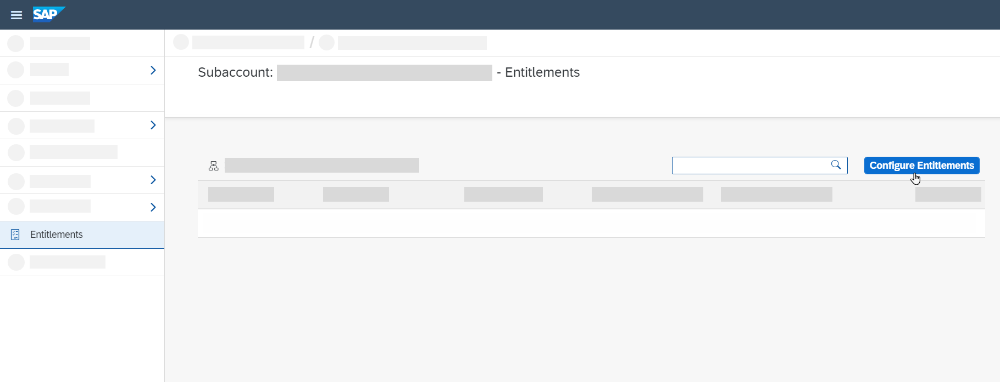
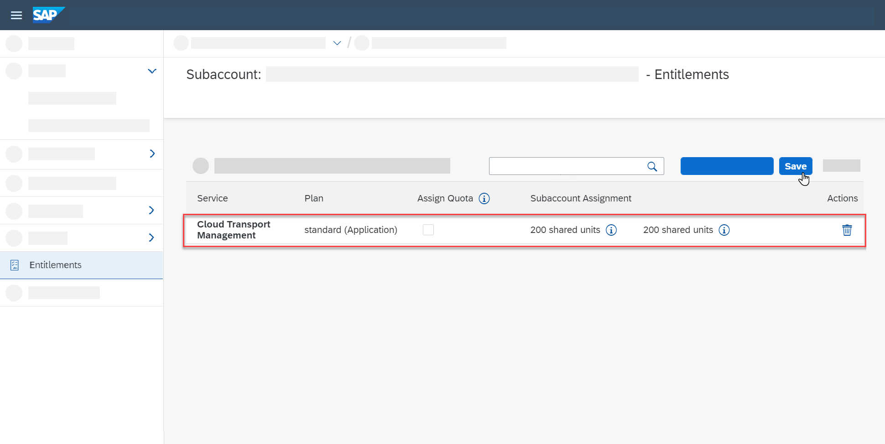
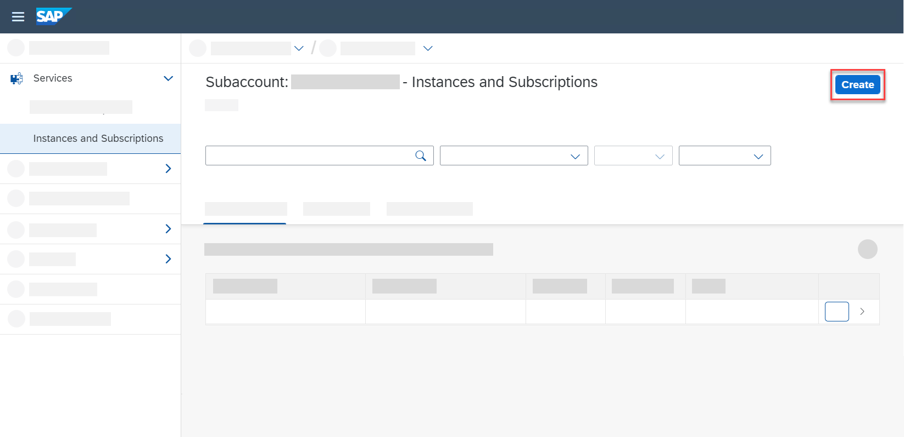
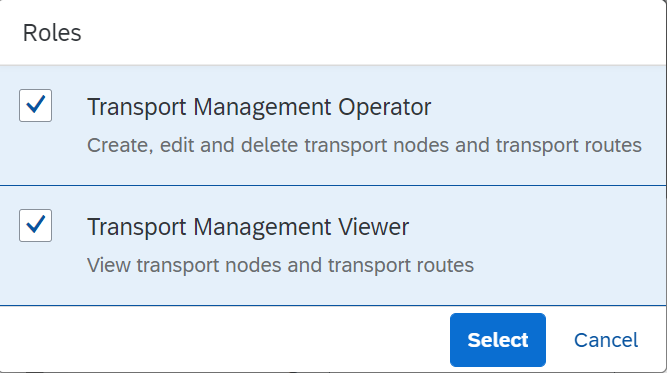
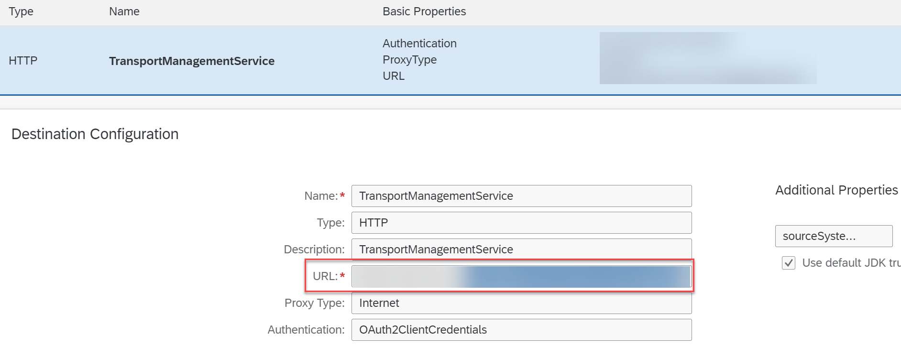

<!-- loio730ae36cc6ca419aae747012015cc686 -->

# SAP Cloud Transport Management Service

By enabling the transport management for the SAP Cloud Transport Management service, you can orchestrate the deployment of transport requests through your implementation landscape.

To use the transport capabilities of SAP Cloud ALM in conjunction with the SAP Cloud Transport Management service, you first have to establish a connection between them.

> ### Note:  
> SAP Cloud ALM supports the parallel delivery of several nodes at once.
> 
> Before you can use the deployment functionality in SAP Cloud ALM, you have to configure the nodes in the SAP Cloud Transport Management service.

<a name="loio730ae36cc6ca419aae747012015cc686__section_rgk_qjh_nsb"/>

## Prerequisites

-   You've set up the product \(for example, SAP Integration Suite\) with which you want to integrate the SAP Cloud Transport Management service for SAP Cloud ALM.

    For more information about the general setup, refer to [Initial Setup of SAP Cloud Integration in the Cloud Foundry Environment](https://help.sap.com/docs/CLOUD_INTEGRATION/368c481cd6954bdfa5d0435479fd4eaf/302b47b11e1749c3aa9478f4123fc216.html).

-   Familiarize yourself with how to use the [SAP Business Technology Platform \(SAP BTP\)](https://help.sap.com/viewer/product/BTP/Cloud/en-US?task=discover_task) cockpit, in particular [Account Administration](https://help.sap.com/products/BTP/65de2977205c403bbc107264b8eccf4b/5d62ec89de39442f8f31d527855cbced.html) concepts.

-   You're subscribed to the SAP Cloud Transport Management service.

    If you're not yet subscribed to the service, perform the following steps:

    1.  Open the [SAP BTP cockpit](https://cockpit.eu10.hana.ondemand.com/cockpit).

    2.  Select the global account that contains your SAP Cloud ALM entitlement, which was created when you requested SAP Cloud ALM.

    3.  Under *Subaccounts*, select the subaccount that contains your SAP Cloud ALM subscription.

    4.  Go to *Entitlements* and choose *Configure Entitlements*.

          

    5.  Search for the *Cloud Transport Management* service in the search bar. If no results are shown in the service list, choose *Add Service Plans*.

          

    6.  Select *Standard \(Application\) Standard Plan* and choose *Add 1 Service Plan*.

          

    7.  Choose *Save*.

          

    8.  Go to *Instances and Subscriptions* and select the *Cloud Transport Management* service.

    9.  Choose *Create*.

          

    10. Select the *Standard* plan.

    11. Choose *Create*.

        You're now subscribed to the SAP Cloud Transport Management service.

-   Your team members are assigned to transport management roles. Usually, the two roles you need are *Transport Management Viewer* and *Transport Management Operator*.

    You can assign the roles in the *User Management* app in SAP Cloud ALM.

      

    For more information, refer to [Assign Roles to Users in SAP Cloud ALM](https://help.sap.com/docs/CloudALM/08879d094f3b4de3ac67832f4a56a6de/7304b17f3aac4ebaa24c5c6a3a8e236e.html?q=Assign%20Roles%20to%20Users%20in%20SAP%20Cloud%20ALM).

    With these roles, you can access the Cloud Transport Management service from within your subaccount in the SAP BTP cockpit by choosing *Go to Application*.

      

-   To create transport nodes, refer to [Create Transport Nodes](https://help.sap.com/docs/TRANSPORT_MANAGEMENT_SERVICE/7f7160ec0d8546c6b3eab72fb5ad6fd8/f71a4d5550cd453ea824d5b5c677969d.html?version=Cloud).

    > ### Note:  
    > You have to use auto forward and upload application content to dev node manually.

<a name="loio730ae36cc6ca419aae747012015cc686__section_i5k_rjh_nsb"/>

## Procedure

1.  **Set Up the Product**

    Set up the specific use case according to the respective documentation, for example [Enabling Content Transport, Cloud Foundry Environment](https://help.sap.com/docs/CLOUD_INTEGRATION/368c481cd6954bdfa5d0435479fd4eaf/452c677debfc4fda904310560ab03743.html?version=Cloud).

2.  **Set Up an SAP Cloud ALM API Instance**

    Set up the SAP Cloud ALM API instance and the Change and Deployment display and the scope management by performing the steps described in [Enabling SAP Cloud ALM API](enabling-sap-cloud-alm-api-704b5dc.md).

3.  **Set Up HTTP Destinations and Transport Routes with SAP Cloud ALM Pass-Through**

    > ### Note:  
    > The following steps apply only to the SAP Integration Suite. For other integrations, refer to the relevant documentation.

    The product requires a destination to the SAP Cloud Transport Management service. In the SAP BTP subaccount where your source product tenant is hosted, create a destination targeted at the SAP Cloud Transport Management service.

    To set up the HTTP destination, refer to [Creating HTTP Destinations and Transport Route](https://help.sap.com/docs/CLOUD_INTEGRATION/368c481cd6954bdfa5d0435479fd4eaf/270f353a5b69472696617d91ceb58c93.html). Go to the *Cloud Transport Management* tab.

    In the URL section for the endpoint, enter the URL of your SAP Cloud ALM API instance that follows the pattern ***https://eu10.alm.cloud.sap/api/imp-cdm-transport-management-api/v1***. The first part of the URL until `/api` depends on your company account and is variable.

      

