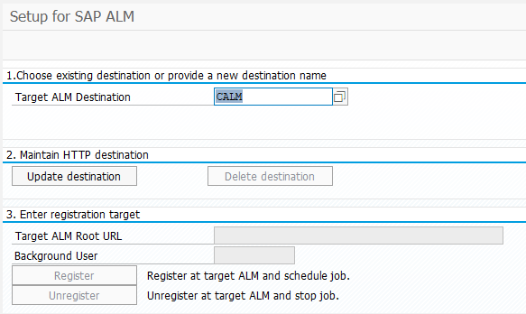
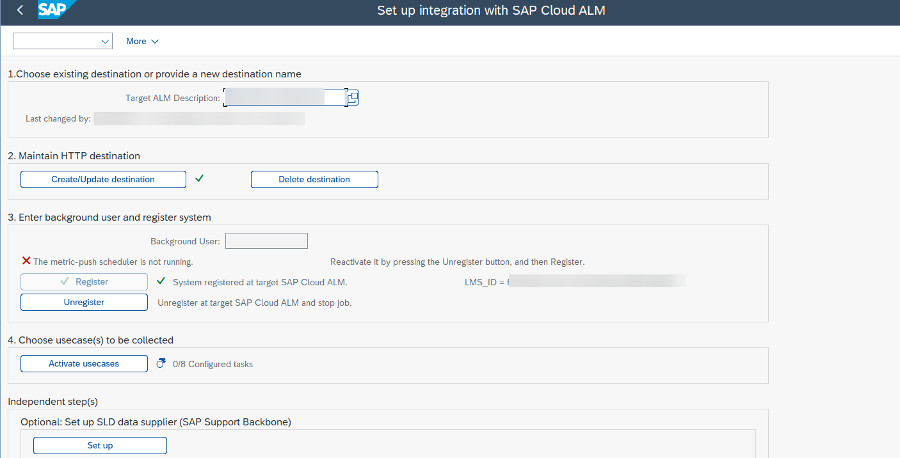
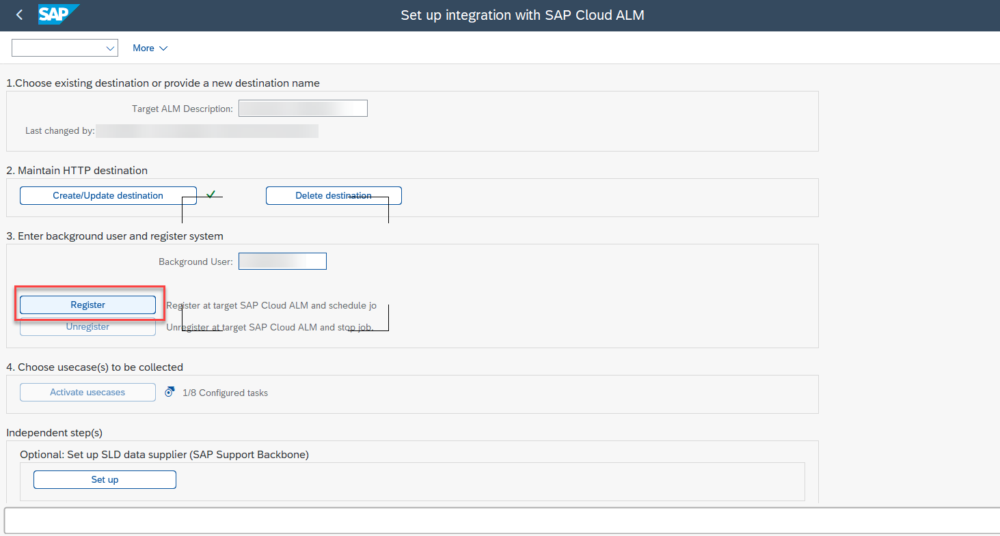
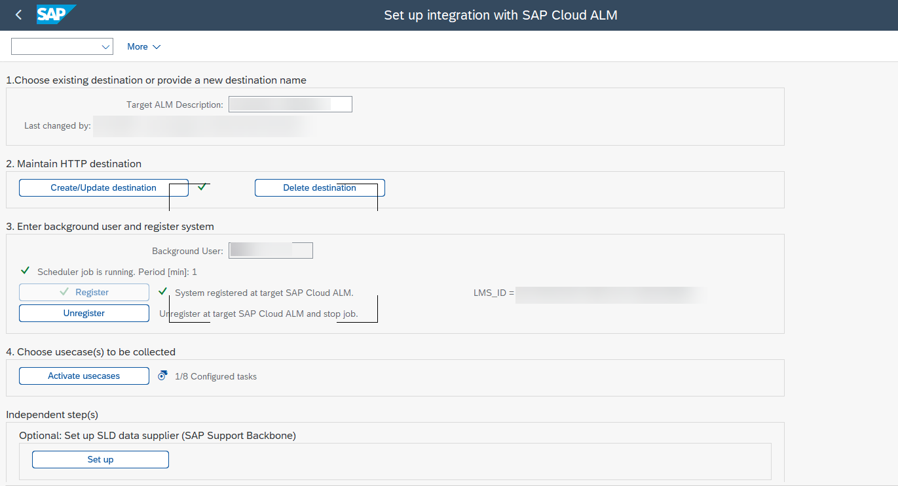

<!-- loio5aa24f076e3b4b47839f762baa7d089a -->

# SAP S/4HANA Cloud, Private Edition and On-Premise Systems

By enabling the transport management for SAP S/4HANA Cloud, private edition, and SAP NetWeaver Application Server for ABAP on-premise, you can orchestrate the deployment of transport requests through your implementation landscape.

In order to use the `Change and Transport System (CTS)` for SAP S/4HANA Cloud, private edition, and SAP NetWeaver Application Server for ABAP on-premise in an SAP Cloud ALM environment, you have to establish a connection between SAP Cloud ALM and the `Change and Transport System (CTS)`. This guide explains all steps that are needed to set up this connection.

SAP Cloud ALM supports the integration of `Change and Transport System (CTS)` for SAP S/4HANA Cloud, private edition, and SAP NetWeaver Application Server for ABAP on-premise.

> ### Caution:  
> Please be aware that transport-related data will be pushed to SAP Cloud ALM from your managed systems by setting up the integration. This includes data of the transport owner.

<a name="loio5aa24f076e3b4b47839f762baa7d089a__section_mx3_ds4_sqb"/>

## Technical Prerequisites for the ABAP System

Before you can start enabling the transport management for SAP S/4HANA Cloud, private edition or SAP NetWeaver Application Server for ABAP on-premise, you need to fulfill the following prerequisites:

-   Install SAP\_BASIS 7.40 SP20 or higher \(accordingly 7.50 SP04\).

-   Install ST-PI 7.40 SP17 or higher. Additionally, please install [3133333 - Collective corrections as of ST-PI 7.40 SP17 for SAP Cloud ALM.](https://launchpad.support.sap.com/#/notes/3133333).

-   To enable the support of complex landscapes using TMS target groups, the following prerequisites are required:
    -   ST-PI 740 SP18 or higher

    -   For SP18 and SP19 please follow SAP Note [3221589](https://launchpad.support.sap.com/#/notes/3221589). [3201146](https://launchpad.support.sap.com/#/notes/3201146) is already included in SAP Note [3221589 that](https://launchpad.support.sap.com/#/notes/3221589 that).

    -   With the release of SP20, SAP Note [3221589](https://launchpad.support.sap.com/#/notes/3221589) will be already included and doesn't have to be installed.

-   To enable the release of transports within a feature, the following prerequisites are required:

    -   ST-PI 740 SP18 or higher

    -   For SP18 and SP19 please follow SAP Note [3228978](https://launchpad.support.sap.com/#/notes/3228978)

    -   With the release of SP20, SAP Note [3228978](https://launchpad.support.sap.com/#/notes/3228978) will be already included and doesn't have to be installed.

-   Check that the profile parameter`icm/HTTPS/client_sni_enabled` is set to ***TRUE***. For more information, refer to SAP Note [510007](https://launchpad.support.sap.com/#/notes/510007).

    > ### Posting Instructions:  
    > For the profile parameter check, you can use the transaction `RZ11` in the managed system.

-   Check that profile parameter `ssl/client_ciphersuites` is set as described in section 7 of SAP Note [510007](https://launchpad.support.sap.com/#/notes/510007) Additional considerations for setting up SSL on Application Server ABAP.

-   Check that[DigiCert Global Root CA](https://support.sap.com/en/alm/sap-cloud-alm/operations/expert-portal/setup-managed-services/setup-abap/setup-strust.html) is imported in `STRUST` under `SSL Client (Anonymous)` and`SSL Client (Standard)`.

<a name="loio5aa24f076e3b4b47839f762baa7d089a__section_sdm_xx4_sqb"/>

## Required Authorizations

You need to consider two users in the managed ABAP system for the setup. Please note that the authorization steps are only needed for system client 000. For other clients these steps can't be performed.

-   To run transaction `/SDF/ALM_SETUP`, the user needs the PFCG role `SAP_SDF_ALM_SETUP`.

    > ### Note:  
    > In this role, you need to maintain the authorization field `S_BTCH_NAM > BTCUNAME` either with '\*' or with the user name of the user you plan to use as data collection background job user.

-   The user you specify as background user, requires the PFCG role `SAP_SDF_ALM_METRIC_PUSH_FND` and the role `SAP_BC_TRANSPORT_ADMINISTRATOR`.

    Download the latest version of the role `SAP_SDF_ALM_METRIC_PUSH_FND` from SAP Note [3104662](https://launchpad.support.sap.com/#/notes/3104662).

<a name="loio5aa24f076e3b4b47839f762baa7d089a__section_pws_sst_tqb"/>

## Procedure

### Create a Space and Configure Entitlements

As a first step, you need to create a space and configure your entitlements in the subaccount containing your SAP Cloud ALM subscription. To do this, perform the steps described in [Enabling SAP Cloud ALM API](enabling-sap-cloud-alm-api-704b5dc.md).

### Configuration of the PUSH Data Provider

The configuration of the push data provider is needed to enable the processing of batch jobs. These batch jobs are then scheduled to send and receive data as well as tasks that are needed for the processing of transport jobs.

1.  Log on to `ABAP system client 000`.

    > ### Note:  
    > Step 1 has to be performed for each system that has to be connected.

2.  Start transaction`/n/SDF/ALM_SETUP`.

    If you start the transaction the first time, it will look like this:

      

    In transaction `/SDF/ALM_SETUP`, perform the following steps:

3.  Target SAP Cloud ALM Destination

    1.  To create a new `SAP Cloud ALM Destination`, enter a name \(e.g. SAP Cloud ALM\) and confirm your input with the [Enter\] key.

    2.  To change an existing SAP Cloud ALM destination, select one from the [F4\] input help and press [Enter\].

    3.  Press [Enter\]. The subsequent fields are filled out automatically.

4.  Maintain HTTP Destination

    1.  Choose *Update Destination*.

    2.  Copy the content of the JSON file you've created in the **Create a Service Key** section. Choose *Paste Service Keys* and paste it into the text field popup.

        Alternatively, you can enter the required fields for SAP Cloud ALM manually:

        > ### Note:  
        > 1.  Token Endpoint: Enter the SAP Cloud ALM `OAuth URL`.
        > 
        >     > ### Note:  
        >     > Example for an OAuth URL: `url + /oauth/token`,e.g. `calm-tenant.authentication.eu10.hana.ondemand.com/oauth/token`
        > 
        > 2.  Client ID: Enter SAP Cloud ALM `client ID`.
        > 
        > 3.  Client Secret: Enter SAP Cloud ALM `client secret`.
        > 
        > 4.  `Proxy User` \(if necessary\)
        > 
        > 5.  `Proxy Password` \(if necessary\)
        > 
        > 6.  `Proxy Host` \(if required by your network infrastructure. For SAP S/4HANA Cloud, private edition, enter value: proxy\)
        > 
        > 7.  `Proxy Port` \(if required by your network infrastructure. For SAP S/4HANA Cloud, private edition, enter value: 3128\)

    3.  Choose *Continue*. The destination should now be updated.

    4.  Choose *Continue*. A success message appears that the connection was established.

5.  Enter Registration Target

    1.  If the *Target ALM Root URL* field is not already pre-filled due to the previous steps, enter the target SAP Cloud ALM root URL depending on your region, e.g. ***https://eu20.alm.cloud.sap.***

        This is the URL that is shown in the JSON file during the creation of the service key. The URL is shown under *endpoints.API* or *uaa.url* respectively. The SAP Cloud ALM root URL depends on the region of the SAP BTP the customer account was created under. Currently, this could be either `eu10.alm.cloud.sap` or `eu20.alm.cloud.sap`.

    2.  Enter the background user you created to perform the data collection.

    3.  Choose *Register* to call SAP Cloud ALM and register the system.

    4.  Choose *Continue*.

        If it’s successful, an `LMS ID` is retrieved and is displayed.

    5.  To unregister a system, choose *Unregister*.

        > ### Note:  
        > This stops all data collection and heartbeat measurements.

6.  Select the use cases you want to collect and push data for. The push mechanism supports the following use-cases:

    -   For development systems: `Feature Deployment: Manage Transports`

    -   For a domain controller system: Feature Deployment: Read Landscape

    -   All other systems \(test or production\): `Feature Deployment: Import Transports` 

        After you've selected the use case, choose *Continue*.

    > ### Note:  
    > Further information about activating use cases:
    > 
    > **Feature Deployment: Read Landscape**
    > 
    > -   Reports the `STMS` landscape configuration to SAP Cloud ALM.
    > 
    > -   Only necessary to set up on one system per domain \(that is the domain controller\). A domain controller is mandatory for the `TMS`. Using the same domain controller to connect to SAP Cloud ALM is optional.
    > 
    > -   Currently supported landscapes:
    > 
    >     -   Landscapes with at least two systems per route \(also virtual systems\)
    > 
    >     -   Landscapes with basic consolidation and/or delivery targets, e.g. TMS quality assurance or transport workflow. These are optional workflows. For more information about these workflows please refer to the following documentation:[TMS Quality Assurance and Transport Workflow](https://help.sap.com/doc/saphelp_qim100/1.0/en-US/9c/a544c6c57111d2b438006094b9ea64/frameset.htm).
    > 
    >     -   Landscapes with client-specific transport routes or by using the `Central Technical Configuration (CTC)`. Using CTC is optional.
    > 
    >     -   Support of several transport groups.
    > 
    > 
    > **Feature Deployment: Manage Transports**
    > 
    > -   Feature Deployment: Manage Transports reports transport requests to SAP Cloud ALM for assignment to features.
    > 
    > -   It’s only necessary to set up on source systems, specifically `DEV` systems.
    > 
    > 
    > **Feature Deployment: Import Transports**
    > 
    > -   This task queries to-be-imported requests from SAP Cloud ALM and triggers the import job.
    > 
    > -   It's only necessary to set up on consolidation and target systems for import \(that is, `QA` and `PRD`\)

    > ### Note:  
    > Commonly, authorization-checks are performed in the system in which a change happens.
    > 
    > In case of the *Features* app, this app takes over the authorization-checkfor importing transports in the SAP Cloud ALM environment instead of the managed system.
    > 
    > In the managed system, the user you specified as background user for the data collection performs the transport actions.
    > 
    > Since this background user has transport authorization by definition, the distinct check whether a specific end user is allowed to perform a transport operation is done in SAP Cloud ALM.

7.  If everything is set up correctly, it should look like this:

      

> ### Caution:  
> If you want to change the transport configuration in the Transport Management System, please make sure that all current changes are completed and deployed to the production system. Additionally, the transport buffers should be empty. Otherwise the respective transport buffers need to be adjusted manually by you.

<a name="loio5aa24f076e3b4b47839f762baa7d089a__section_amq_jvv_k5b"/>

## Configuration of Client Dependent Use Cases

To enable the release of transports within an SAP Cloud ALM feature, you have to execute the following setup in each development client you are using.

1.  Log on to the respective ABAP system client and start transaction `/n/SDF/ALM_SETUP`.

2.  You can reuse the SAP Cloud ALM destination from your PUSH data configuration.

    At the start of the process, the transaction looks like this:

      

3.  In the *Maintain HTTP Destination* section, choose *Update Destination* and paste the JSON file you've already created in the *Create a Service Key* part of the *Configuration of the PUSH Data Provider* section of this guide.

4.  Choose *Unregister* in the *Enter Background User and Register System* section.

5.  Enter the background user you've created to perform the data collection. Then, choose *Register* to call SAP Cloud ALM and register the system. Confirm the scheduling of the respective jobs.

      

    If it’s successful, an `LMS ID` is retrieved and is displayed.

6.  Select the use case you want to activate:

    -   Feature Deployment: Manage Transport per Client
    -   This task queries to-be-released transport requests from SAP Cloud ALM and triggers the release job.
    -   It's necessary to execute this setup on all development clients you use for customizing activities.

7.  If everything is set up correctly it should look like this:

      

